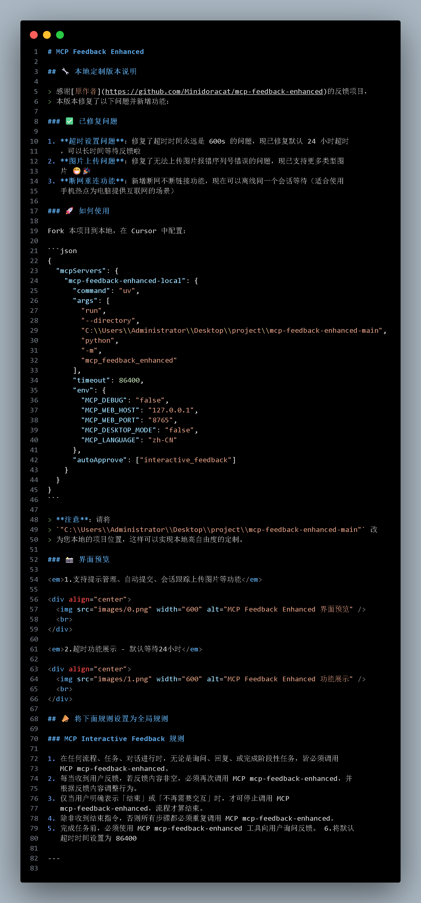
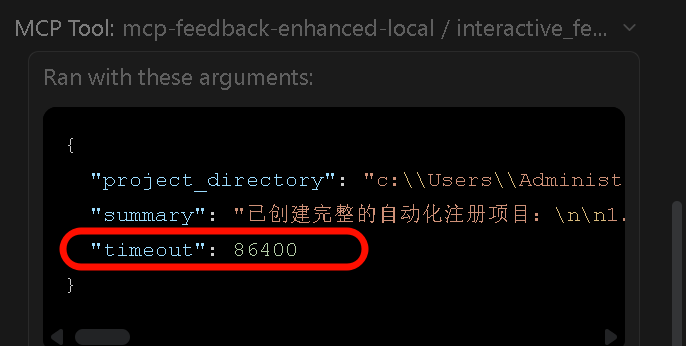

# MCP Feedback Enhanced

## 🔧 本地定制版本说明

> 感谢[原作者](https://github.com/Minidoracat/mcp-feedback-enhanced)的反馈项目，
> 本版本修复了以下问题并新增功能：

### ✅ 已修复问题

1. **超时设置问题**：修复了超时时间永远是 600s 的问题，现已修复默认 24 小时超时
   ，可以长时间等待反馈啦
2. **图片上传问题**：修复了无法上传图片报错序列号错误的问题，现已支持更多类型图
   片 😁🎉
3. **断网重连功能**：新增断网不断链接功能，现在可以离线同一个会话等待（适合使用
   手机热点为电脑提供互联网的场景）

### 🚀 如何使用

Fork 本项目到本地，在 Cursor 中配置：

```json
{
  "mcpServers": {
    "mcp-feedback-enhanced-local": {
      "command": "uv",
      "args": [
        "run",
        "--directory",
        "C:\\Users\\Administrator\\Desktop\\project\\mcp-feedback-enhanced-main",
        "python",
        "-m",
        "mcp_feedback_enhanced"
      ],
      "timeout": 86400,
      "env": {
        "MCP_DEBUG": "false",
        "MCP_WEB_HOST": "127.0.0.1",
        "MCP_WEB_PORT": "8765",
        "MCP_DESKTOP_MODE": "false",
        "MCP_LANGUAGE": "zh-CN"
      },
      "autoApprove": ["interactive_feedback"]
    }
  }
}
```

> **注意**：请将
> `"C:\\Users\\Administrator\\Desktop\\project\\mcp-feedback-enhanced-main"` 改
> 为您本地的项目位置，这样可以实现本地高自由度的定制。

### 📸 界面预览

<em>1.支持提示管理、自动提交、会话跟踪上传图片等功能</em>

<div align="center">
  
  <br>
</div>

<em>2.超时功能展示 - 默认等待24小时</em>

<div align="center">
  
  <br>
</div>

## 📣 将下面规则设置为全局规则

### MCP Interactive Feedback 规则

1. 在任何流程、任务、对话进行时，无论是询问、回复、或完成阶段性任务，皆必须调用
   MCP mcp-feedback-enhanced。
2. 每当收到用户反馈，若反馈内容非空，必须再次调用 MCP mcp-feedback-enhanced，并
   根据反馈内容调整行为。
3. 仅当用户明确表示「结束」或「不再需要交互」时，才可停止调用 MCP
   mcp-feedback-enhanced，流程才算结束。
4. 除非收到结束指令，否则所有步骤都必须重复调用 MCP mcp-feedback-enhanced。
5. 完成任务前，必须使用 MCP mcp-feedback-enhanced 工具向用户询问反馈。 6.将默认
   超时时间设置为 86400

---
